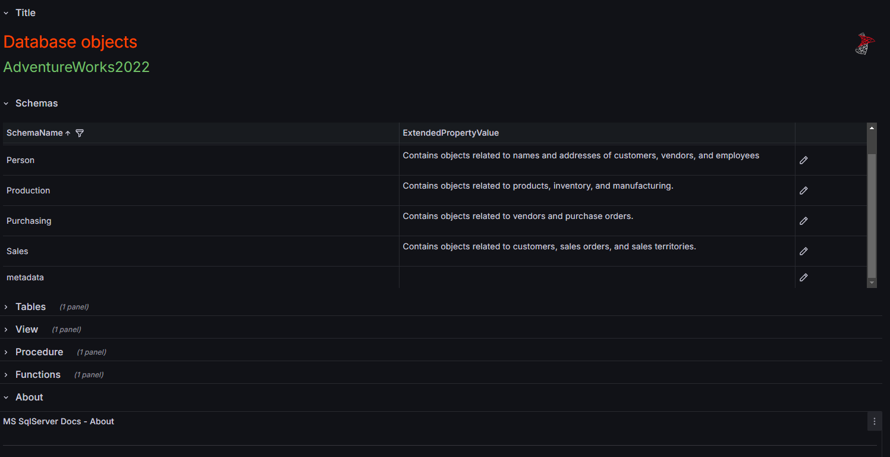
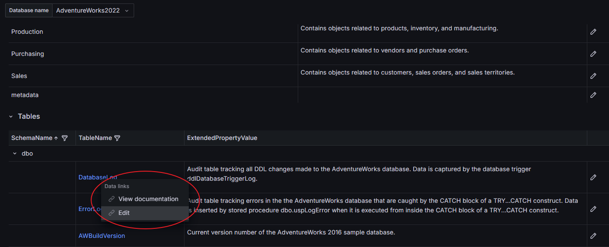
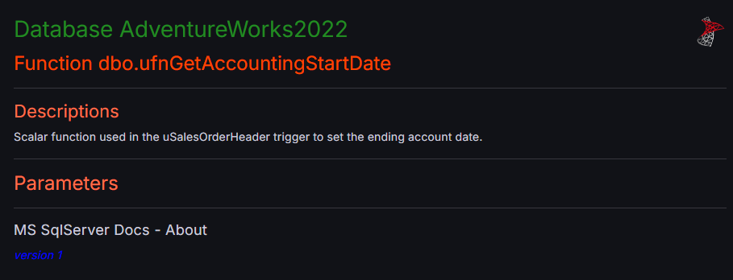
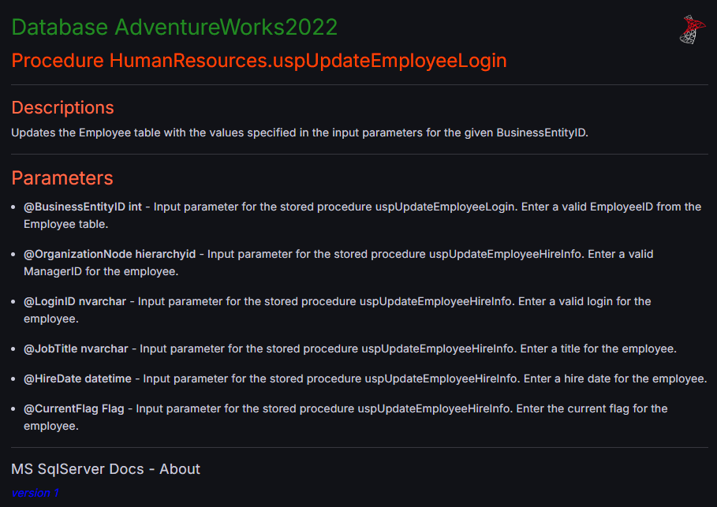
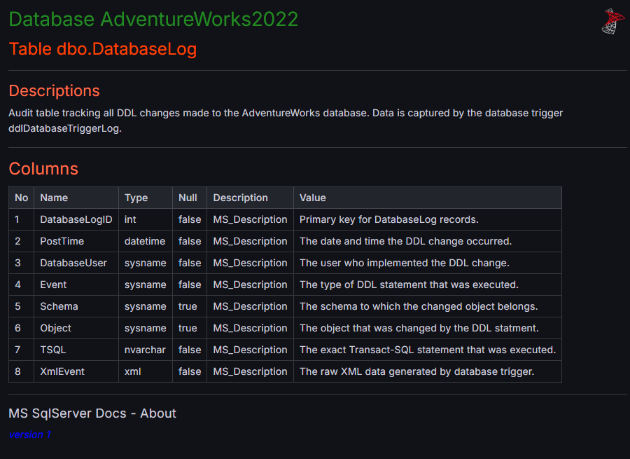
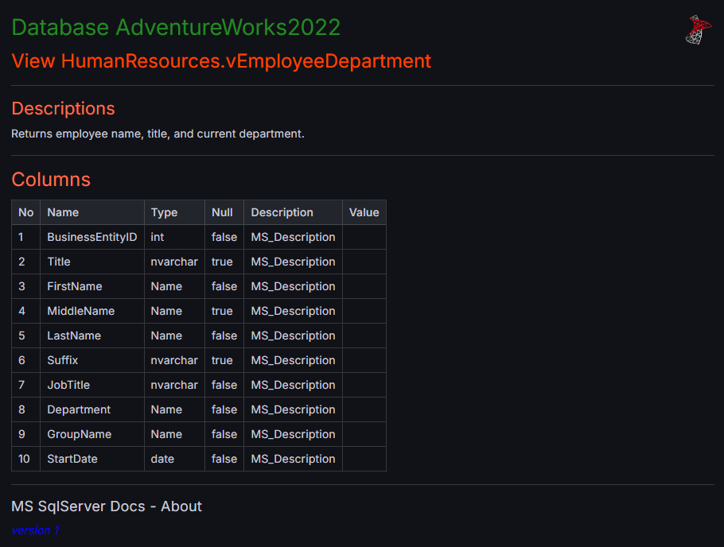
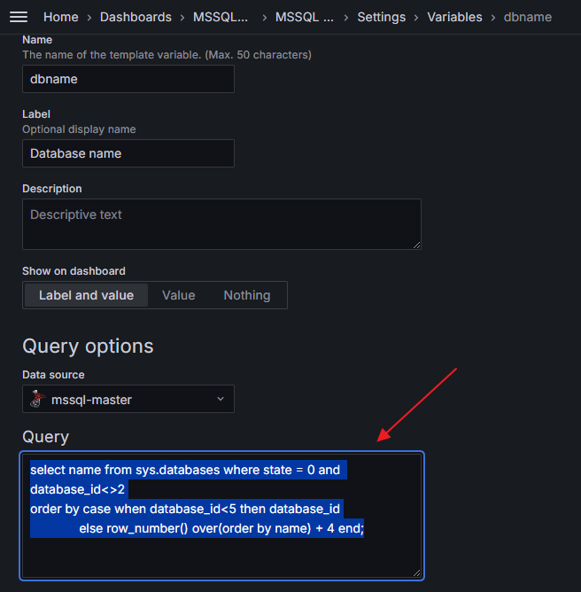

# Набор бордов grafana для документирования баз MSSQL Server

Grafana v11.4.0

Для документирования используются расширенные свойства и стандартное свойство ***MS_Decription***.

Список бордов:

- **"MSSQL Doc - Common object"** - основной, список объектов таблиц, представлений, функций, хранимых процедур   
  
Для просмотра дополнительной информации просто выбираем необходимую ссылку:
  
С списке информации о документировании отображается только расширенное свойство ***MS_Decription***, все возможные свойства можно просмотреть в дополнительных бордах для конкретного типа объекта.

- **"MSSQL Doc - Function"** - представление для просмотра или экспорта данных о функции  


- **"MSSQL Doc - Function Editable"** - редактирование расширенных свойств функции

- **"MSSQL Doc - Procedure"** - представление для просмотра или экспорта хранимой процедуре  


- **"MSSQL Doc - Procedure Editable"** - редактирование расширенных свойств процедуры

- **"MSSQL Doc - Table"** - представление для просмотра или экспорта данных о таблице  


- **"MSSQL Doc - Table Editable"** - редактирование расширенных свойств таблицы

- **"MSSQL Doc - View"** - представление для просмотра или экспорта данных о представлении  

- **"MSSQL Doc - View Editable"** - редактирование расширенных свойств представления

Борды используемые для просмотра/экспорта выполнены в одной панели для более удобного экспорта в изображение.

Борды для редактирования содержат дополнительную информацию о расширенных свойствах и позволяют редактировать данные.

## Настройка соединения

Для работы бордов используется соединение с сервером MSSQL Server, где в качестве основной базы указана база `master`.

## Ограничение списка баз

Для ограничения доступных баз отредактируйте переменную в борде **"MSSQL Doc - Common object"**


основной запрос

```sql
select name from sys.databases where state = 0 and database_id<>2
order by case when database_id<5 then database_id
              else row_number() over(order by name) + 4 end;
```

## Дополнительные компоненты

В бордах используется <a href="https://volkovlabs.io/plugins/business-text/" target="_blank">business text</a> и <a href="https://volkovlabs.io/plugins/business-table/" target="_blank">business table</a> от <a href="https://volkovlabs.io" target="_blank">volkovlabs.io</a>

Для корректной работы необходимо разрешить HTML, так что не забываем включить

```
- GF_PANELS_DISABLE_SANITIZE_HTML=true
```

## Экспорт борда в изображение

Для экпорта используется стандартный экспорт grafana или с использованием url

```  
http://localhost:3000/render/d-solo/eeb8pqnn9hj40b?var-pshema=dbo&var-ptable=ufnGetAccountingStartDate&var-dbname=AdventureWorks2022&orgId=1&panelId=panel-11&__feature.dashboardSceneSolo&width=1000&height=500
```

где может быть полезно заменить размеры изображения используя параметры `height` и `width`

```
&width=1000&height=500
```

