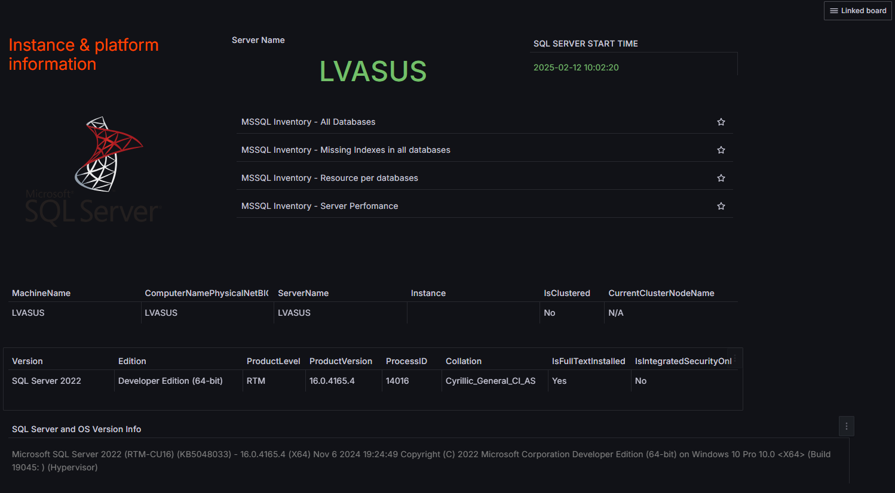

# MsSqlInventory - анализ текущего состояния и инвентаризация

"MSSQL Inventory - All Databases" - список всех баз 

"MSSQL Inventory - Database" - данные о базе

"MSSQL Inventory - Database all index" - данные о всех индексах

"MSSQL Inventory - Database all statistics" - данные о статистике в базе

"MSSQL Inventory - Database all tables" - данные о всех таблицах

"MSSQL Inventory - Database Missing Indexes" - отсутсвующие индексы в базе

"MSSQL Inventory - Database Query Store" - данные о хранилице запросов

"MSSQL Inventory - Database Security" - пользователи, сертификаты, ключи, шифрование

"MSSQL Inventory - Missing Indexes in all databases" - отсутсвующие индексы во всех базах на сервере

"MSSQL Inventory - Resource per databases" - использование ресусов: размеры, IO, CPU, buffer

"MSSQL Inventory - Server" - сводная информация о сервере

"MSSQL Inventory - Server Perfomance" - сводная информация о производительности сервере

"MSSQL Inventory - Simple Database all table rows count" - количество строк в таблицах базы данных

"MSSQL Inventory - Simple Database List" - список баз на сервере

"MSSQL Inventory - Simple Database List State" - список баз на сервере и состояние баз

"MSSQL Inventory - TableInfo" - данные о таблице
