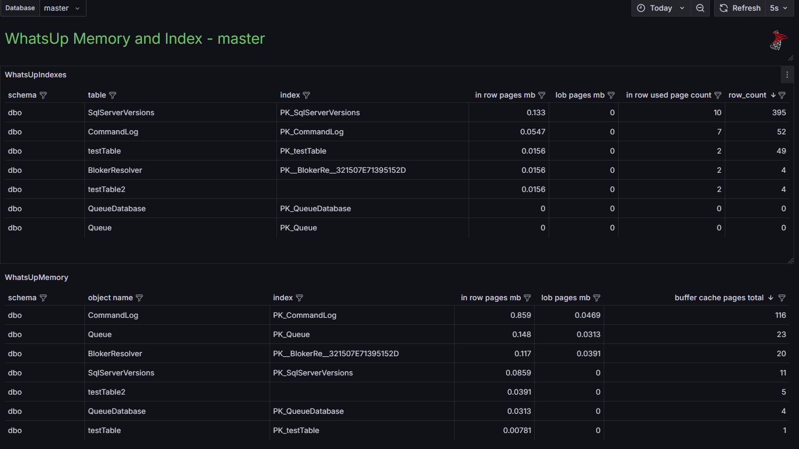
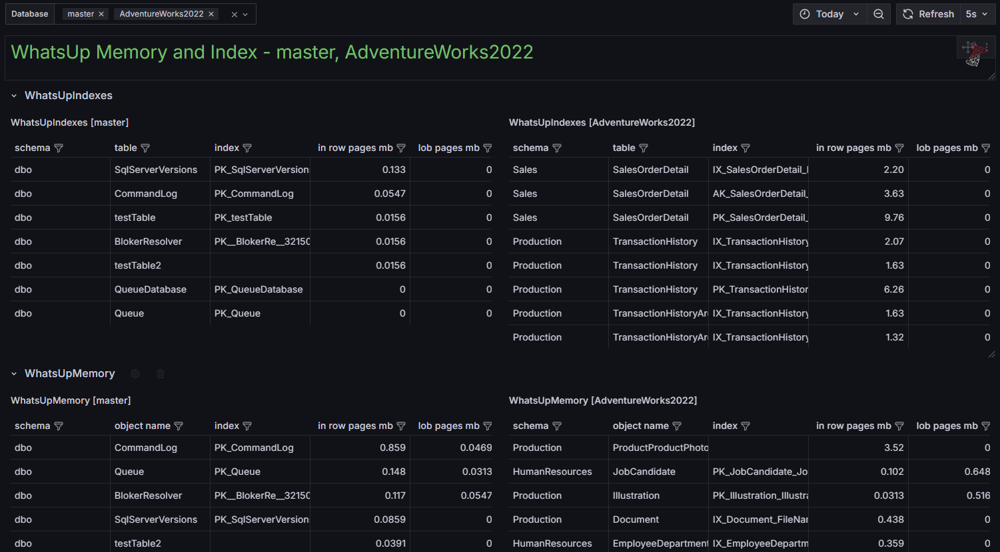
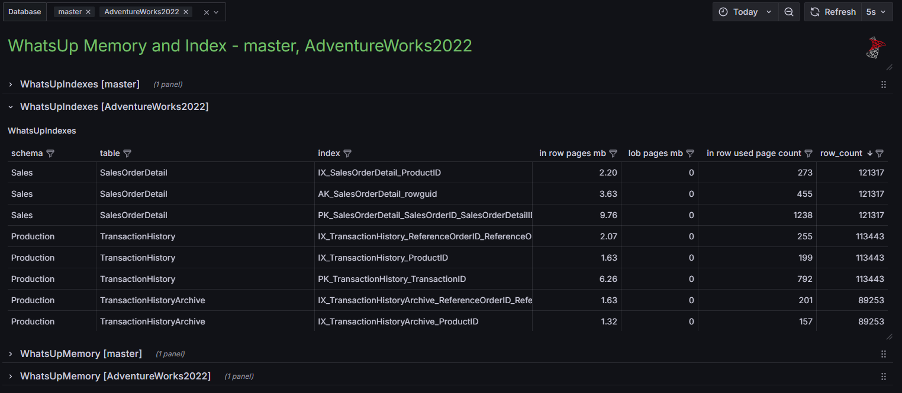
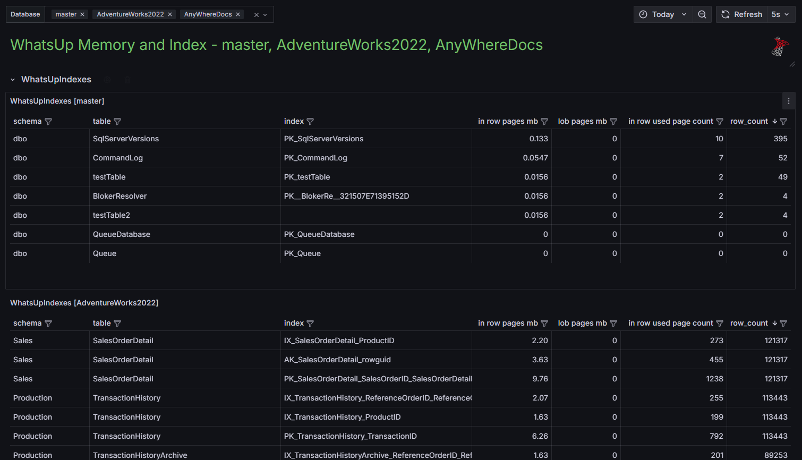

# MsSqlWhatsup - данные о интексах и пямяти в текущий момент

- **"MSSQLWhatsUpBoard"** - данные для одной базы

- **"MSSQLWhatsUpBoardMultyBaseH"** - несколько баз, данные в группе по индексам и памяти, в одной строке по две базы

- **"MSSQLWhatsUpBoardMultyBaseRows"** - несколько баз, данные по индексам и памяти в отдельной группе для каждой базы

- **"MSSQLWhatsUpBoardMultyBaseV"** - несколько баз,две группы - индексы и пямять  

